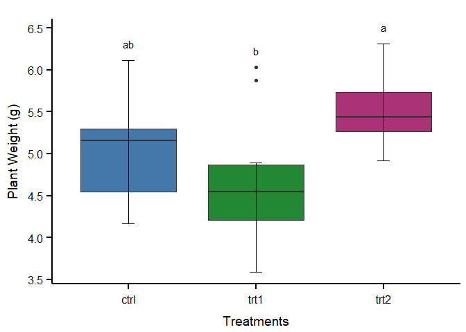

Boxplot with Tukey Test and Lettering
================
RwithAammar
12/6/2021

### Install following packages

    install.packages("readxl")
    install.packages("tidyverse")
    install.packages("agricolae")
    install.packages("devtools")
    install.packages("Writexl")
    devtools::install_github("JLSteenwyk/ggpubfigs")
    install.packages("ggpubr")

### Load following Packges

``` r
library(readxl)
library(tidyverse)
```

    ## -- Attaching packages --------------------------------------- tidyverse 1.3.1 --

    ## v ggplot2 3.3.5     v purrr   0.3.4
    ## v tibble  3.1.6     v dplyr   1.0.7
    ## v tidyr   1.1.4     v stringr 1.4.0
    ## v readr   2.1.0     v forcats 0.5.1

    ## -- Conflicts ------------------------------------------ tidyverse_conflicts() --
    ## x dplyr::filter() masks stats::filter()
    ## x dplyr::lag()    masks stats::lag()

``` r
library(agricolae)
library(devtools)
```

    ## Loading required package: usethis

``` r
library(writexl)
library(ggpubfigs)
```

    ## 
    ## Attaching package: 'ggpubfigs'

    ## The following object is masked from 'package:ggplot2':
    ## 
    ##     theme_grey

``` r
library(ggpubr)
```

### Load dataset or import your own data set after setting the working directory in R-studio **(Ctrl+shift+H)**

``` r
data("PlantGrowth")
write_xlsx(PlantGrowth, ".\\PlantGrowth.xlsx") #export excel file
inp_data <- read_excel("PlantGrowth.xlsx") #import excel file from same directory
print(inp_data)
```

    ## # A tibble: 30 x 2
    ##    weight group
    ##     <dbl> <chr>
    ##  1   4.17 ctrl 
    ##  2   5.58 ctrl 
    ##  3   5.18 ctrl 
    ##  4   6.11 ctrl 
    ##  5   4.5  ctrl 
    ##  6   4.61 ctrl 
    ##  7   5.17 ctrl 
    ##  8   4.53 ctrl 
    ##  9   5.33 ctrl 
    ## 10   5.14 ctrl 
    ## # ... with 20 more rows

### Statistical Calculation and lettering using TUKEY HSD test.

``` r
value_max = inp_data %>% 
  group_by(group) %>% 
  summarize(max_value = max(weight)) #calculating the maximum value to draw letters
hsd=HSD.test(aov(weight ~ group, data=inp_data), trt = "group", group = T)
sig.letters <- hsd$groups[order(row.names(hsd$groups)), ] 
```

### Visualize data and make Boxplot

``` r
#Boxplot
ggplot(data = inp_data, aes(x = group, y = weight, fill=group))+ 
  geom_boxplot()+
  stat_boxplot(geom = 'errorbar', width = 0.1)+
  geom_text(data = value_max, aes(x=group, y = 0.15 + max_value, 
                                  label = sig.letters$groups), vjust=0)+
  ggtitle("") + xlab("Treatments") + ylab("Plant Weight (g)")+
  scale_fill_manual(values = friendly_pal("bright_seven")) + theme_simple()+
  theme(legend.position = "none")
```

<!-- -->

### Saving Boxplot in High quality in the same working dorectory

    #Visualization
    ###############################################################
    ggplot(data = inp_data, aes(x = group, y = weight, fill=group))+ 
      geom_boxplot()+
      stat_boxplot(geom = 'errorbar', width = 0.1)+
      geom_text(data = value_max, aes(x=group, y = 0.15 + max_value, 
                                      label = sig.letters$groups), vjust=0)+
      ggtitle("") + xlab("Treatments") + ylab("Plant Weight (g)")+
      scale_fill_manual(values = friendly_pal("bright_seven")) + theme_simple()+
      theme(legend.position = "none")+
      ggsave("PLantGrowth.tiff", units="in", width=8, height=8, dpi=300, compression = 'lzw')
