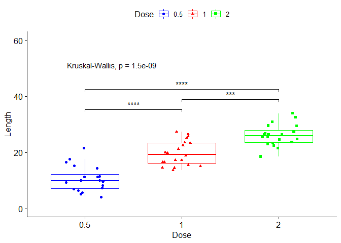
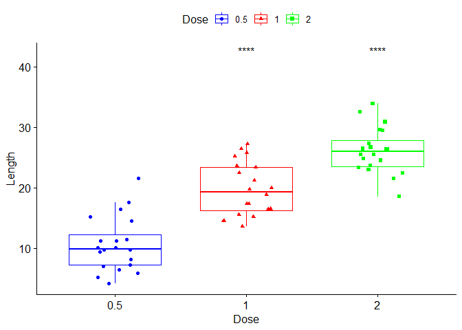
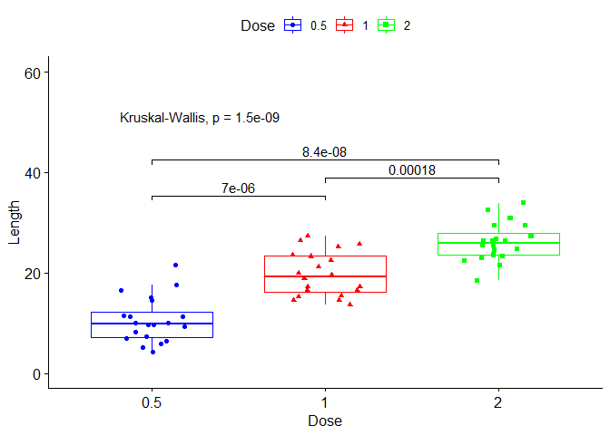
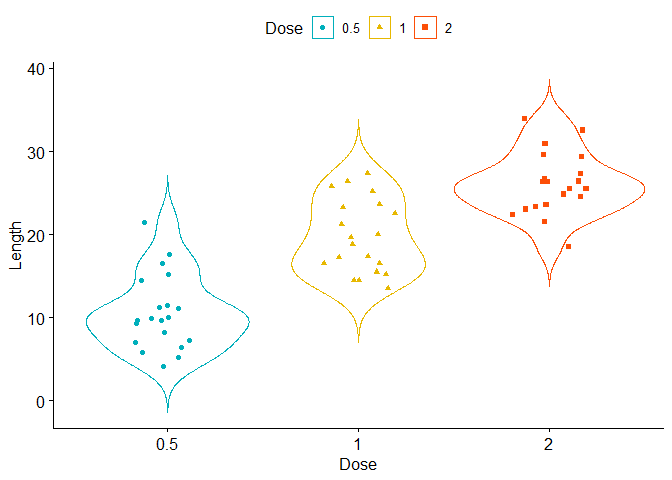
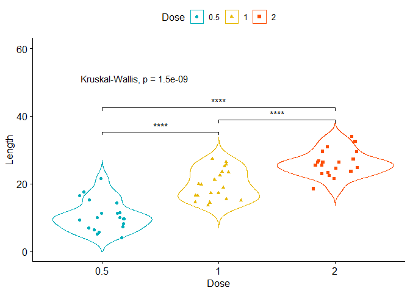
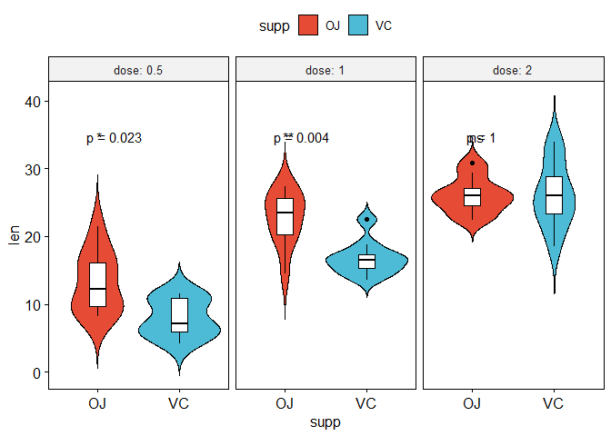

Welcome to RwithAammar - Publication Ready Graphs (Part-3)
================
RwithAammar
09/12/2021

## Install following packages

    install.packages("readxl")
    install.packages("tidyverse")
    #main package for Today
    install.packages("ggpubr")

## Load All Packages

``` r
library(readxl)
library(tidyverse)
```

    ## -- Attaching packages --------------------------------------- tidyverse 1.3.1 --

    ## v ggplot2 3.3.5     v purrr   0.3.4
    ## v tibble  3.1.6     v dplyr   1.0.7
    ## v tidyr   1.1.4     v stringr 1.4.0
    ## v readr   2.1.0     v forcats 0.5.1

    ## -- Conflicts ------------------------------------------ tidyverse_conflicts() --
    ## x dplyr::filter() masks stats::filter()
    ## x dplyr::lag()    masks stats::lag()

``` r
library(ggpubr)
```

# 1- Boxplot with jitter points and means comparison

## Import Data set in R

USe built in data set **ToothGrowth**

``` r
data("ToothGrowth")
head(ToothGrowth)
```

    ##    len supp dose
    ## 1  4.2   VC  0.5
    ## 2 11.5   VC  0.5
    ## 3  7.3   VC  0.5
    ## 4  5.8   VC  0.5
    ## 5  6.4   VC  0.5
    ## 6 10.0   VC  0.5

## Draw a simple boxplot

``` r
p1 <- ggboxplot(ToothGrowth, x = "dose", y = "len",
          color = "dose", palette =c("blue", "red", "green"),
          add = "jitter", shape = "dose", 
          xlab = "Dose", ylab = "Length", legend.title="Dose");p1
```

<!-- -->

## showing mean comparisons

Specify the comparisons you want

``` r
my_comparisons <- list( c("0.5", "1"), c("1", "2"), c("0.5", "2"))
```

## show significant stars

``` r
p1 + stat_compare_means(comparisons = my_comparisons,
                       label = "p.signif")+ # Add pairwise comparisons p-value
  stat_compare_means(label.y = 50)+ylim(0,60)  # Add global p-value
```

    ## Warning in wilcox.test.default(c(4.2, 11.5, 7.3, 5.8, 6.4, 10, 11.2, 11.2, :
    ## cannot compute exact p-value with ties

    ## Warning in wilcox.test.default(c(4.2, 11.5, 7.3, 5.8, 6.4, 10, 11.2, 11.2, :
    ## cannot compute exact p-value with ties

    ## Warning in wilcox.test.default(c(16.5, 16.5, 15.2, 17.3, 22.5, 17.3, 13.6, :
    ## cannot compute exact p-value with ties

<!-- -->

## Show significant differnce against control treatment or reference group

``` r
p1 + stat_compare_means(label.y = 42,
                       method = "t.test",
                       label = "p.signif",
                       ref.group = "0.5")  # Add global p-value
```

<!-- -->

## show p-values instead of \*\*\*

``` r
p1 <- p1 + stat_compare_means(comparisons = my_comparisons)+ # Add pairwise comparisons p-value
  stat_compare_means(label.y = 50)+ylim(0,60);p1  # Add global p-value
```

    ## Warning in wilcox.test.default(c(4.2, 11.5, 7.3, 5.8, 6.4, 10, 11.2, 11.2, :
    ## cannot compute exact p-value with ties

    ## Warning in wilcox.test.default(c(4.2, 11.5, 7.3, 5.8, 6.4, 10, 11.2, 11.2, :
    ## cannot compute exact p-value with ties

    ## Warning in wilcox.test.default(c(16.5, 16.5, 15.2, 17.3, 22.5, 17.3, 13.6, :
    ## cannot compute exact p-value with ties

<!-- -->

# Multiple grouping variable

## Box plot facetted by “dose”

``` r
p2 <- ggboxplot(ToothGrowth, x = "supp", y = "len",
               color = "supp", palette = "npg",
               add = "jitter",
               facet.by = "dose", short.panel.labs = FALSE);p2
```

<!-- -->

``` r
# Use only p.format as label. Remove method name.
p2 <- p2 + stat_compare_means(
  aes(label = paste0("p = ", ..p.format..))
);p2
```

<!-- -->

# Making (Converting boxplots) into violin plots

``` r
p3 <- ggviolin(ToothGrowth, x = "dose", y = "len",
                color = "dose", palette =c("#00AFBB", "#E7B800", "#FC4E07"),
                add = "jitter", shape = "dose", 
                xlab = "Dose", ylab = "Length", legend.title="Dose");p3
```

<!-- -->

# show mean comparisons and Specify the comparisons you want

``` r
my_comparisons <- list( c("0.5", "1"), c("1", "2"), c("0.5", "2") )
```

# show significant stars

``` r
p3 <- p3 + stat_compare_means(comparisons = my_comparisons,
                        method = "t.test",
                        label = "p.signif")+ # Add pairwise comparisons p-value
  stat_compare_means(label.y = 50)+ylim(0,60);p3
```

    ## Warning: Removed 25 rows containing missing values (geom_violin).

<!-- -->

## 4- Violin plots with box plots inside

``` r
p4 <- ggviolin(ToothGrowth, x = "supp", y = "len",
                fill = "supp", palette = "npg",
                facet.by = "dose", short.panel.labs = FALSE,
               add = "boxplot", add.params = list(fill = "white"));p4
```

<!-- -->

### Use only p.format as label. Remove method name.

``` r
p4 <- p4 + stat_compare_means(
  aes(label = paste0("p = ", ..p.format..))
);p4
```

<!-- -->

``` r
p4 <- p4 + stat_compare_means(
  aes(label = paste0(..p.signif..))
);p4
```

<!-- -->

############################################################### 

# Publication ready multipannel plots

############################################################### 

``` r
ggarrange(p1, p2, p3,p4 + rremove("x.text"), 
          labels = c("A", "B", "C", "D"),
          ncol = 2, nrow = 2)
```

    ## Warning in wilcox.test.default(c(4.2, 11.5, 7.3, 5.8, 6.4, 10, 11.2, 11.2, :
    ## cannot compute exact p-value with ties

    ## Warning in wilcox.test.default(c(4.2, 11.5, 7.3, 5.8, 6.4, 10, 11.2, 11.2, :
    ## cannot compute exact p-value with ties

    ## Warning in wilcox.test.default(c(16.5, 16.5, 15.2, 17.3, 22.5, 17.3, 13.6, :
    ## cannot compute exact p-value with ties

    ## Warning: Removed 25 rows containing missing values (geom_violin).

<!-- -->

**saving High quality plot in working directory**

    ggarrange(p1, p2, p3,p4 + rremove("x.text"), 
              labels = c("A", "B", "C", "D"),
              ncol = 2, nrow = 2) %>% 
      ggexport(filename = "test.png", res = 200, width = 1600, height = 1600)

## Publication ready Multipannel plot for 3 plots

``` r
ggarrange(p1,                                                 # First row with boxplt
          ggarrange(p2, p3, ncol = 2, labels = c("B", "C")), # Second row with violinplot
          nrow = 2, 
          labels = "A"                                        # Labels of the boxplot plot
) 
```

    ## Warning: Removed 25 rows containing missing values (geom_violin).

    ## Warning in wilcox.test.default(c(4.2, 11.5, 7.3, 5.8, 6.4, 10, 11.2, 11.2, :
    ## cannot compute exact p-value with ties

    ## Warning in wilcox.test.default(c(4.2, 11.5, 7.3, 5.8, 6.4, 10, 11.2, 11.2, :
    ## cannot compute exact p-value with ties

    ## Warning in wilcox.test.default(c(16.5, 16.5, 15.2, 17.3, 22.5, 17.3, 13.6, :
    ## cannot compute exact p-value with ties

<!-- -->

**saving plot in current working directory**

    ggarrange(p1,                                                 # First row with boxplt
              ggarrange(p2, p3, ncol = 2, labels = c("B", "C")), # Second row with violinplot
              nrow = 2, 
              labels = "A"                                        # Labels of the boxplot plot
    ) %>% 
      ggexport(filename = "test2.png", res = 200, width = 1600, height = 1600)
