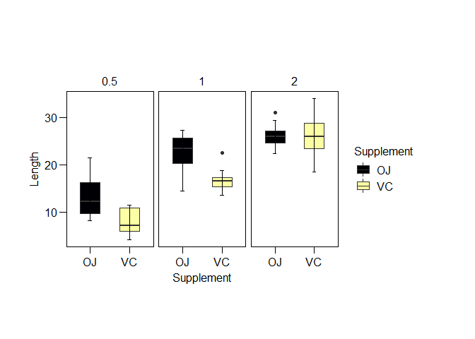
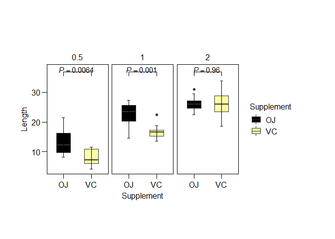

04-Adding p_values
================
RwithAammar
10/12/2021

## install Packages

    install.packages("ggplot2")
    install.packages("ggpval")

## load packages

``` r
library(ggplot2)
library(ggpval)
```

## draw a boxplot (or any other plot based on your need)

``` data("toothgrowth")```
```r
p <- ggplot(ToothGrowth) +
  aes(x = supp, y = len, fill = supp) +
  geom_boxplot(shape = "circle", width=0.5) +
  stat_boxplot(geom = 'errorbar', width = 0.1)+
  scale_fill_viridis_d(option = "inferno", direction = 1) +
  labs(x = "Supplement", y = "Length", fill = "Supplement") +
  ggthemes::theme_par() +
  facet_wrap(vars(dose));p
```

<!-- -->

**Adding pvalue using ggpval function**

``` r
add_pval(p, pairs = list(c(1,2)), 
         test = "t.test")
```

<!-- -->

## more options in ggpval **package**

``` r
help("add_pval")
```

    ## starting httpd help server ... done

## you can save your plot using following code

    tiff('test.tiff', units="in", width=10, height=6, res=300, compression = 'lzw')
    add_pval(p, pairs = list(c(1,2)), 
             test = "t.test")
    dev.off()

subscribe share our video at this
(link)[https://youtu.be/agPZErYUsRg]
