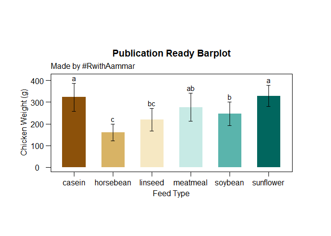

7 Step guide to make Publication Ready Bargraphs from Scratch
================
RwithAammar
12/11/2021

# This guide will show you how to make publication ready barplots from scratch.

## Intsall these packages if you have not and load them:

``` r
library(ggplot2)
library(ggthemes)
library(multcompView)
library(dplyr)
```

    ## 
    ## Attaching package: 'dplyr'

    ## The following objects are masked from 'package:stats':
    ## 
    ##     filter, lag

    ## The following objects are masked from 'package:base':
    ## 
    ##     intersect, setdiff, setequal, union

## 1- Load or import your data

We will use the following builtin dataset for this example:

``` r
data("chickwts")
tibble(chickwts) #tibble is a function of dplyr package
```

    ## # A tibble: 71 x 2
    ##    weight feed     
    ##     <dbl> <fct>    
    ##  1    179 horsebean
    ##  2    160 horsebean
    ##  3    136 horsebean
    ##  4    227 horsebean
    ##  5    217 horsebean
    ##  6    168 horsebean
    ##  7    108 horsebean
    ##  8    124 horsebean
    ##  9    143 horsebean
    ## 10    140 horsebean
    ## # ... with 61 more rows

## 2- Calculate *means* of you treatment groups and the *standard deviation* SD to show on error bars as follows:

``` r
mean_data <- group_by(chickwts, feed) %>% #feed is our treatmnet in this example
  summarise(weight_mean=mean(weight), sd = sd(weight)) %>% #to calculate mean and SD
  arrange(desc(weight_mean)) #to arange in descending order
tibble(mean_data)
```

    ## # A tibble: 6 x 3
    ##   feed      weight_mean    sd
    ##   <fct>           <dbl> <dbl>
    ## 1 sunflower        329.  48.8
    ## 2 casein           324.  64.4
    ## 3 meatmeal         277.  64.9
    ## 4 soybean          246.  54.1
    ## 5 linseed          219.  52.2
    ## 6 horsebean        160.  38.6

## 3- This step involves performing analysis of variance *ANOVA*, using buitin **aov()** function.

Here we will draw *ANOVA* of weight against the group of treatment
(feed) in Chickwts data

``` r
anova <- aov(weight ~ feed, data = chickwts)
summary(anova)
```

    ##             Df Sum Sq Mean Sq F value   Pr(>F)    
    ## feed         5 231129   46226   15.37 5.94e-10 ***
    ## Residuals   65 195556    3009                     
    ## ---
    ## Signif. codes:  0 '***' 0.001 '**' 0.01 '*' 0.05 '.' 0.1 ' ' 1

## 4- If the ANOVA is significantly diffrent then, we will draw a multiple mean comparison test (TUKEY HSD, LSD, or Duncan Multiple Range) on *anova* object from previous step.

*Here is an example of TUKEY HSD test* *Important Note:* You can also
use other tests and look for their commands by using ***agricolae***
package in this step.

``` r
tukey <- TukeyHSD(anova)
tukey
```

    ##   Tukey multiple comparisons of means
    ##     95% family-wise confidence level
    ## 
    ## Fit: aov(formula = weight ~ feed, data = chickwts)
    ## 
    ## $feed
    ##                            diff         lwr       upr     p adj
    ## horsebean-casein    -163.383333 -232.346876 -94.41979 0.0000000
    ## linseed-casein      -104.833333 -170.587491 -39.07918 0.0002100
    ## meatmeal-casein      -46.674242 -113.906207  20.55772 0.3324584
    ## soybean-casein       -77.154762 -140.517054 -13.79247 0.0083653
    ## sunflower-casein       5.333333  -60.420825  71.08749 0.9998902
    ## linseed-horsebean     58.550000  -10.413543 127.51354 0.1413329
    ## meatmeal-horsebean   116.709091   46.335105 187.08308 0.0001062
    ## soybean-horsebean     86.228571   19.541684 152.91546 0.0042167
    ## sunflower-horsebean  168.716667   99.753124 237.68021 0.0000000
    ## meatmeal-linseed      58.159091   -9.072873 125.39106 0.1276965
    ## soybean-linseed       27.678571  -35.683721  91.04086 0.7932853
    ## sunflower-linseed    110.166667   44.412509 175.92082 0.0000884
    ## soybean-meatmeal     -30.480519  -95.375109  34.41407 0.7391356
    ## sunflower-meatmeal    52.007576  -15.224388 119.23954 0.2206962
    ## sunflower-soybean     82.488095   19.125803 145.85039 0.0038845

This will give us the significant differences based on each combination
of treatment groups from (feed). We can draw conclusion from this step
and write manually the significant difference. But *hold on* you can
also show these differences in bar plots in R.

## 5- Draw multiple comparison letters using *multcomp* R package as follows:

``` r
group_letters <- multcompLetters4(anova, tukey)
# we have to mention both anova model and tukey objects to get group letters
group_letters
```

    ## $feed
    ## sunflower    casein  meatmeal   soybean   linseed horsebean 
    ##       "a"       "a"      "ab"       "b"      "bc"       "c"

As we have group letters now in step-5, we can extract these group
letters add them to our *mean_data* a data frame developed in step-2 as
follows:

``` r
#extracting group letters
group_letters <- as.data.frame.list(group_letters$feed)
#adding to the mean_data
mean_data$group_letters <- group_letters$Letters
tibble(mean_data)
```

    ## # A tibble: 6 x 4
    ##   feed      weight_mean    sd group_letters
    ##   <fct>           <dbl> <dbl> <chr>        
    ## 1 sunflower        329.  48.8 a            
    ## 2 casein           324.  64.4 a            
    ## 3 meatmeal         277.  64.9 ab           
    ## 4 soybean          246.  54.1 b            
    ## 5 linseed          219.  52.2 bc           
    ## 6 horsebean        160.  38.6 c

\*Finally we have completed our statistical part, now we have to draw
the bar plot and show the significant difference on it.

## 6- Drawing the *publication ready Barplot* in ggplot2

``` r
p <- ggplot(mean_data, aes(x = feed, y = weight_mean)) +
  geom_bar(stat = "identity", aes(fill = feed), show.legend = FALSE, width = 0.6) + #barplot
  geom_errorbar( #this argument is putting sd as error bars
    aes(ymin = weight_mean-sd, ymax=weight_mean+sd), 
    width = 0.1
    ) + 
  geom_text(aes(label = group_letters, y = weight_mean + sd), vjust=-0.4) + #add letters
  scale_fill_brewer(palette = "BrBG", direction = 1) + #theme setting
  labs(#this will add labels 
    x = "Feed Type",
    y = "Chicken Weight (g)",
    title = "Publication Ready Barplot",
    subtitle = "Made by #RwithAammar",
    fill = "Feed Type"
  ) +
  ylim(0,410)+ #change your yaxis limits based on the letters
  ggthemes::theme_par(); p
```

<!-- -->

## 7- Saving upto 4K barplots in R

-   First choose a working directory by pressing *ctrl+shift+H* and
    select a folder then run the following code to save in **.tiff**:

``` r
tiff('Barplot.tiff', units="in", width=10, height=6, res=300, compression = 'lzw')
p
dev.off()
```

    ## png 
    ##   2

subscribe share our video at this
(link)\[<https://studio.youtube.com/video/agPZErYUsRg/edit>\]
