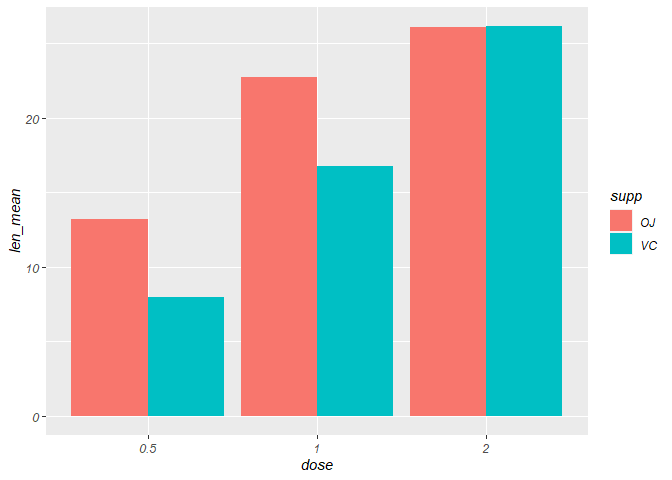

7 Steps guide to make Publication Ready Bargraphs from Scratch (TWO-Way
ANOVA)
================
RwithAammar
12/12/2021

### This guide will show you how to make publication ready barplots with *TWO-WAY ANOVA* from scratch.

# **Group barplot with TWO-WAy ANova in R**

## Install these packages if you have not and load them:

``` r
library(ggplot2)
library(ggthemes)
library(multcompView)
library(dplyr)
```

    ## 
    ## Attaching package: 'dplyr'

    ## The following objects are masked from 'package:stats':
    ## 
    ##     filter, lag

    ## The following objects are masked from 'package:base':
    ## 
    ##     intersect, setdiff, setequal, union

``` r
library(stats) 
```

## *1- Create/load a data set*

We will use the following built-in dataset for this example:

``` r
data2 <- ToothGrowth
data2$dose = as.factor(data2$dose)
```

## *2- Calculating Two Way ANOVA*

``` r
anova <- aov(len ~ supp*dose, data = data2) #two way anova
summary(anova) #represents ANOVA
```

    ##             Df Sum Sq Mean Sq F value   Pr(>F)    
    ## supp         1  205.4   205.4  15.572 0.000231 ***
    ## dose         2 2426.4  1213.2  92.000  < 2e-16 ***
    ## supp:dose    2  108.3    54.2   4.107 0.021860 *  
    ## Residuals   54  712.1    13.2                     
    ## ---
    ## Signif. codes:  0 '***' 0.001 '**' 0.01 '*' 0.05 '.' 0.1 ' ' 1

## *3- Multiple Mean Comparison Analysis (only if you have significant differences in Two-way anova)*

``` r
tukey <- TukeyHSD(anova)
tukey
```

    ##   Tukey multiple comparisons of means
    ##     95% family-wise confidence level
    ## 
    ## Fit: aov(formula = len ~ supp * dose, data = data2)
    ## 
    ## $supp
    ##       diff       lwr       upr     p adj
    ## VC-OJ -3.7 -5.579828 -1.820172 0.0002312
    ## 
    ## $dose
    ##         diff       lwr       upr   p adj
    ## 1-0.5  9.130  6.362488 11.897512 0.0e+00
    ## 2-0.5 15.495 12.727488 18.262512 0.0e+00
    ## 2-1    6.365  3.597488  9.132512 2.7e-06
    ## 
    ## $`supp:dose`
    ##                diff        lwr        upr     p adj
    ## VC:0.5-OJ:0.5 -5.25 -10.048124 -0.4518762 0.0242521
    ## OJ:1-OJ:0.5    9.47   4.671876 14.2681238 0.0000046
    ## VC:1-OJ:0.5    3.54  -1.258124  8.3381238 0.2640208
    ## OJ:2-OJ:0.5   12.83   8.031876 17.6281238 0.0000000
    ## VC:2-OJ:0.5   12.91   8.111876 17.7081238 0.0000000
    ## OJ:1-VC:0.5   14.72   9.921876 19.5181238 0.0000000
    ## VC:1-VC:0.5    8.79   3.991876 13.5881238 0.0000210
    ## OJ:2-VC:0.5   18.08  13.281876 22.8781238 0.0000000
    ## VC:2-VC:0.5   18.16  13.361876 22.9581238 0.0000000
    ## VC:1-OJ:1     -5.93 -10.728124 -1.1318762 0.0073930
    ## OJ:2-OJ:1      3.36  -1.438124  8.1581238 0.3187361
    ## VC:2-OJ:1      3.44  -1.358124  8.2381238 0.2936430
    ## OJ:2-VC:1      9.29   4.491876 14.0881238 0.0000069
    ## VC:2-VC:1      9.37   4.571876 14.1681238 0.0000058
    ## VC:2-OJ:2      0.08  -4.718124  4.8781238 1.0000000

## *4- Extract lettering from TWO-WAY ANOVA and Tukey’s Test:*

``` r
# compact letter display
group_lettering <- multcompLetters4(anova, tukey) #
group_lettering
```

    ## $supp
    ##  OJ  VC 
    ## "a" "b" 
    ## 
    ## $dose
    ##   2   1 0.5 
    ## "a" "b" "c" 
    ## 
    ## $`supp:dose`
    ##   VC:2   OJ:2   OJ:1   VC:1 OJ:0.5 VC:0.5 
    ##    "a"    "a"    "a"    "b"    "b"    "c"

``` r
group_lettering2 <- data.frame(group_lettering$`supp:dose`$Letters)
group_lettering2
```

    ##        group_lettering..supp.dose..Letters
    ## VC:2                                     a
    ## OJ:2                                     a
    ## OJ:1                                     a
    ## VC:1                                     b
    ## OJ:0.5                                   b
    ## VC:0.5                                   c

## *5- Calculating and adding mean, sd and lettering columns to the data set:*

``` r
mean_data2 <- data2 %>% 
  group_by(supp, dose) %>% 
  summarise(len_mean=mean(len), sd = sd(len)) %>% #to calculate mean and SD
  arrange(desc(len_mean)) #to arange in descending order
```

    ## `summarise()` has grouped output by 'supp'. You can override using the `.groups` argument.

``` r
tibble(mean_data2)
```

    ## # A tibble: 6 x 4
    ##   supp  dose  len_mean    sd
    ##   <fct> <fct>    <dbl> <dbl>
    ## 1 VC    2        26.1   4.80
    ## 2 OJ    2        26.1   2.66
    ## 3 OJ    1        22.7   3.91
    ## 4 VC    1        16.8   2.52
    ## 5 OJ    0.5      13.2   4.46
    ## 6 VC    0.5       7.98  2.75

``` r
mean_data2$group_lettering <- group_lettering2$group_lettering..supp.dose..Letters
```

## *6- Drawing Publication ready Barplots with TWO-WAY ANOVA*

-   *Draw Basic Barplot*

``` r
ggplot(mean_data2, aes(x = dose, y = len_mean,group=supp))  +
  geom_bar(position=position_dodge(0.9),stat = "identity", aes(fill = supp), 
           show.legend = TRUE)
```

<!-- -->

-   *Add erro Bars *(sd)\* on the plot\*

``` r
ggplot(mean_data2, aes(x = dose, y = len_mean,group=supp))  +
  geom_bar(position=position_dodge(0.9),stat = "identity", aes(fill = supp), show.legend = TRUE) + #barplot
  geom_errorbar(aes(ymin = len_mean-sd, ymax=len_mean+sd),width = 0.1, position=position_dodge(0.9))
```

<!-- -->

-   *Add lettering to error bars*

``` r
ggplot(mean_data2, aes(x = dose, y = len_mean,group=supp))+
  geom_bar(position=position_dodge(0.9),stat = "identity", aes(fill = supp), show.legend = TRUE) + #barplot
  geom_errorbar(aes(ymin = len_mean-sd, ymax=len_mean+sd),width = 0.1, position=position_dodge(0.9)) + 
  geom_text(aes(label = group_lettering, y = len_mean + sd), vjust=-0.4, position=position_dodge(0.9)) #add letters
```

<!-- -->

-   *Final Publication Ready group bar plot with TWO-Way ANOVA (Type-1)*

``` r
#grouped barplot
p1 <- ggplot(mean_data2, aes(x = dose, y = len_mean,group=supp))  +
  geom_bar(position=position_dodge(0.9),stat = "identity", aes(fill = supp), show.legend = TRUE) + #barplot
  geom_errorbar(aes(ymin = len_mean-sd, ymax=len_mean+sd),width = 0.1, position=position_dodge(0.9)) + 
  geom_text(aes(label = group_lettering, y = len_mean + sd), vjust=-0.4, position=position_dodge(0.9)) + #add letters
  scale_fill_brewer(palette = "BrBG", direction = 1) + #theme setting
  labs(#this will add labels 
    x = "Dose",
    y = "Length (cm)",
    title = "Publication Ready Group Barplot",
    subtitle = "Made by #RwithAammar",
    fill = "Dose"
  ) +
  #facet_wrap(~supp)+
  ylim(0,35)+ #change your yaxis limits based on the letters
  ggthemes::theme_par(); p1
```

<!-- -->

-   *Publication ready grouped barplot with TWO-Way ANOVA with Facets
    (Type-2)*

``` r
p2 <- ggplot(mean_data2, aes(x = dose, y = len_mean,group=supp))  +
  geom_bar(position=position_dodge(0.9),stat = "identity", aes(fill = supp), show.legend = TRUE) + #barplot
  geom_errorbar(aes(ymin = len_mean-sd, ymax=len_mean+sd),width = 0.1, position=position_dodge(0.9)) + 
  geom_text(aes(label = group_lettering, y = len_mean + sd), vjust=-0.4, position=position_dodge(0.9)) + #add letters
  scale_fill_brewer(palette = "BrBG", direction = 1) + #theme setting
  labs(#this will add labels 
    x = "Dose",
    y = "Length (cm)",
    title = "Publication Ready Group Barplot",
    subtitle = "Made by #RwithAammar",
    fill = "Dose"
  ) +
  facet_wrap(~supp)+
  ylim(0,35)+ #change your yaxis limits based on the letters
  ggthemes::theme_par(); p2
```

<!-- -->

## *7- Saving upto 4K barplots in R*

-   First choose a working directory by pressing *ctrl+shift+H* and
    select a folder then run the following code to save in **.tiff**:

``` r
tiff('Barplot_G1.tiff', units="in", width=10, height=6, res=300, compression = 'lzw')
p1
dev.off()
```

    ## png 
    ##   2

``` r
tiff('Barplot_G2.tiff', units="in", width=10, height=6, res=300, compression = 'lzw')
p2
dev.off()
```

    ## png 
    ##   2

subscribe share our video at this
(link)\[<https://www.youtube.com/channel/UCmNXJXWONLNF6bdftGY0Otw>\]

Best regards,

*Dr. Muhammad Aammar Tufail*

Google Certified Data Analyst
