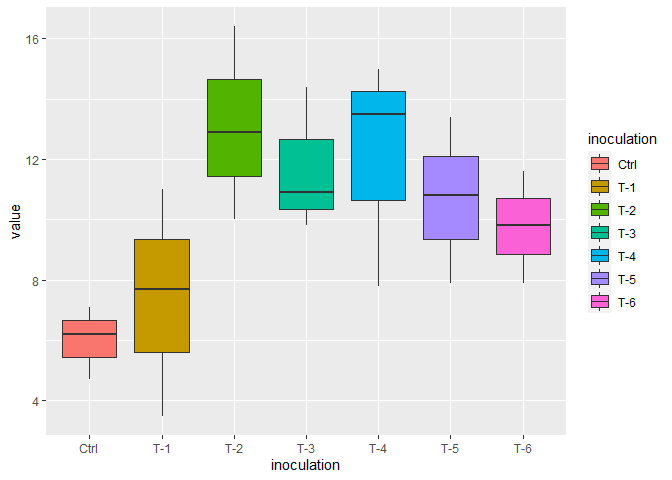
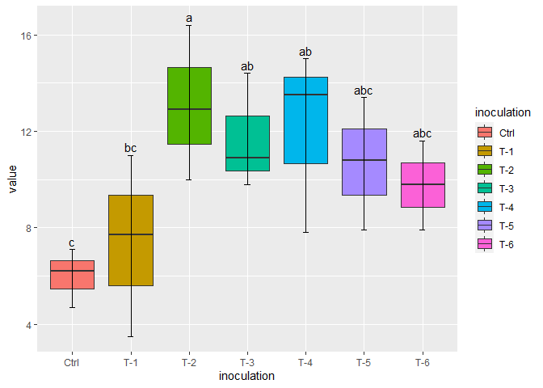
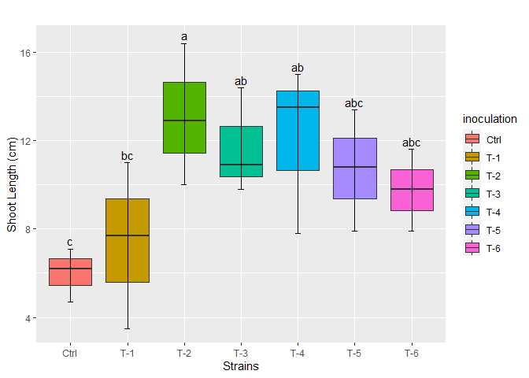
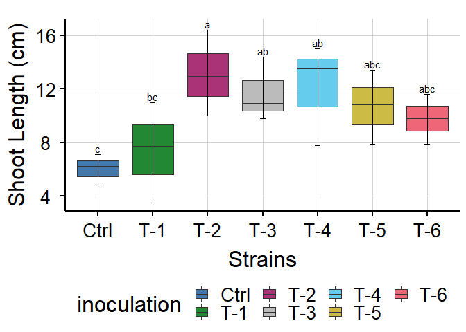
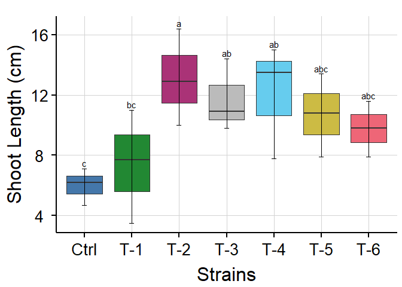
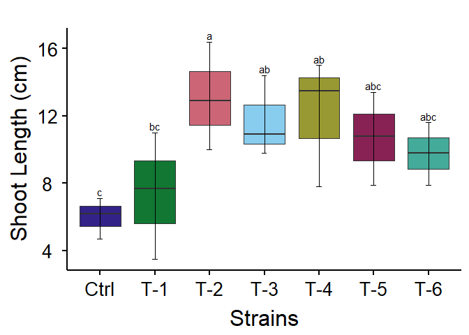

Making a Box_plot with Lettering
================
RwithAammar
11/20/2021

## 1- Install the required packages by using install.packages(““package_name);for ggpubfig use this: (devtools::install_github(”JLSteenwyk/ggpubfigs”) and the library these:

``` r
library(readxl)
library(tidyverse)
```

    ## -- Attaching packages --------------------------------------- tidyverse 1.3.1 --

    ## v ggplot2 3.3.5     v purrr   0.3.4
    ## v tibble  3.1.6     v dplyr   1.0.7
    ## v tidyr   1.1.4     v stringr 1.4.0
    ## v readr   2.1.0     v forcats 0.5.1

    ## -- Conflicts ------------------------------------------ tidyverse_conflicts() --
    ## x dplyr::filter() masks stats::filter()
    ## x dplyr::lag()    masks stats::lag()

``` r
library(agricolae)
library(devtools)
```

    ## Loading required package: usethis

``` r
library(ggpubfigs)
```

    ## 
    ## Attaching package: 'ggpubfigs'

    ## The following object is masked from 'package:ggplot2':
    ## 
    ##     theme_grey

## 2- set your r directory in a folder where your data is present, (Ctrl+shift+h)

## 3- import your dataset into R

``` r
inp_data <- read_excel("rice_growth.xlsx", 
                          col_types = c("text", "text", "numeric"))
print(inp_data)
```

    ## # A tibble: 21 x 3
    ##    inoculation variable          value
    ##    <chr>       <chr>             <dbl>
    ##  1 Ctrl        Shoot Length (cm)   4.7
    ##  2 T-1         Shoot Length (cm)   7.7
    ##  3 T-2         Shoot Length (cm)  12.9
    ##  4 T-3         Shoot Length (cm)  14.4
    ##  5 T-4         Shoot Length (cm)  13.5
    ##  6 T-5         Shoot Length (cm)  10.8
    ##  7 T-6         Shoot Length (cm)   7.9
    ##  8 Ctrl        Shoot Length (cm)   6.2
    ##  9 T-1         Shoot Length (cm)   3.5
    ## 10 T-2         Shoot Length (cm)  16.4
    ## # ... with 11 more rows

## 4- Statitical analysis of your data to get lettering. Here I have used LSD.test to calculate the multiple comparison of means on my data sets:

``` r
value_max = inp_data %>% group_by(inoculation) %>% summarize(max_value = max(value))
lsd=LSD.test(aov(value ~ inoculation, data=inp_data), trt = "inoculation", group = T)
sig.letters <- lsd$groups[order(row.names(lsd$groups)), ] 
```

This will also give you the significant letters along the group of
treatments (inoculation).

## 5- you can also change the order of your treatments to appear on the x-axis:

``` r
inp_data$inoculation <- factor(inp_data$inoculation, levels = c("Ctrl", "T-1", "T-2",
                                                                "T-3", "T-4", "T-5",
                                                                "T-6"))
```

## 6- Plot the simple boxplot using ggplot2

``` r
ggplot(data = inp_data, aes(x = inoculation, y = value, fill=inoculation))+ 
  geom_boxplot()
```

<!-- -->

## 7- Adding caps to the error bars:

``` r
ggplot(data = inp_data, aes(x = inoculation, y = value, fill=inoculation))+ 
  geom_boxplot()+
  stat_boxplot(geom = 'errorbar', width = 0.1)
```

<!-- -->

## 8- Adding significant letters got in step 4

``` r
ggplot(data = inp_data, aes(x = inoculation, y = value, fill=inoculation))+ 
  geom_boxplot()+stat_boxplot(geom = 'errorbar', width = 0.1)+
  geom_text(data = value_max, aes(x=inoculation, y = 0.15 + max_value, 
                                  label = sig.letters$groups), vjust=0)
```

<!-- -->

## 9- Adding axis labels:

``` r
ggplot(data = inp_data, aes(x = inoculation, y = value, fill=inoculation))+ 
  geom_boxplot()+stat_boxplot(geom = 'errorbar', width = 0.1)+
  geom_text(data = value_max, aes(x=inoculation, y = 0.15 + max_value, 
                                  label = sig.letters$groups), vjust=0)+
  ggtitle("") + xlab("Strains") + ylab("Shoot Length (cm)")
```

<!-- -->

## 10- publication ready theme using ggpubfig package:

``` r
library(ggpubfigs)
ggplot(data = inp_data, aes(x = inoculation, y = value, fill=inoculation))+ 
  geom_boxplot()+stat_boxplot(geom = 'errorbar', width = 0.1)+
  geom_text(data = value_max, aes(x=inoculation, y = 0.15 + max_value, 
                                  label = sig.letters$groups), vjust=0)+
  ggtitle("") + xlab("Strains") + ylab("Shoot Length (cm)")+
  scale_fill_manual(values = friendly_pal("bright_seven")) + theme_big_grid()
```

<!-- --> You
can explore more themes and figure types in the followoing website for
ggpubfig:
<https://github.com/JLSteenwyk/ggpubfigs/blob/master/README.md#install>

## 11- Removing legends:

``` r
ggplot(data = inp_data, aes(x = inoculation, y = value, fill=inoculation))+ 
  geom_boxplot()+stat_boxplot(geom = 'errorbar', width = 0.1)+
  geom_text(data = value_max, aes(x=inoculation, y = 0.15 + max_value, 
                                  label = sig.letters$groups), vjust=0)+
  ggtitle("") + xlab("Strains") + ylab("Shoot Length (cm)")+
  scale_fill_manual(values = friendly_pal("bright_seven")) + theme_big_grid()+
  theme(legend.position = "none")
```

<!-- -->

## 12- Saving high quality plots as tiff file in your working directory choosen in step-2

ggplot(data = inp_data, aes(x = inoculation, y = value,
fill=inoculation))+ geom_boxplot()+stat_boxplot(geom = ‘errorbar’, width
= 0.1)+ geom_text(data = value_max, aes(x=inoculation, y = 0.15 +
max_value, label = sig.letters$groups), vjust=0)+ ggtitle(““) +
xlab(”Strains”) + ylab(“Shoot Length (cm)”)+ scale_fill_manual(values =
friendly_pal(“bright_seven”)) + theme_big_grid()+ theme(legend.position
= “none”)+ ggsave(“shoot_length.tiff”, units=“in”, width=8, height=8,
dpi=300, compression = ‘lzw’)

## 13- Change the theme:

``` r
ggplot(data = inp_data, aes(x = inoculation, y = value, fill=inoculation))+ 
  geom_boxplot()+stat_boxplot(geom = 'errorbar', width = 0.1)+
  geom_text(data = value_max, aes(x=inoculation, y = 0.15 + max_value, 
                                  label = sig.letters$groups), vjust=0)+
  ggtitle("") + xlab("Strains") + ylab("Shoot Length (cm)")+
  scale_fill_manual(values = friendly_pal("muted_nine")) + theme_big_simple()+
  theme(legend.position = "none")
```

<!-- -->

Here is the full course about datascience with Aammar #RwithAammar in
Urdu and Hindi:
<https://www.youtube.com/watch?v=rPAyZJ_4X70&list=PL9XvIvvVL50E8HimtAnVL8N70MqImYOLS>
