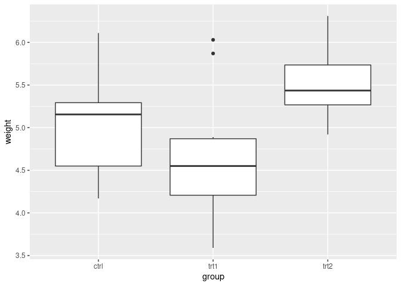
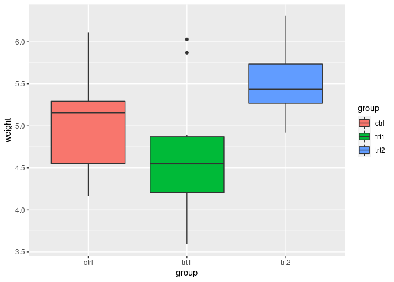
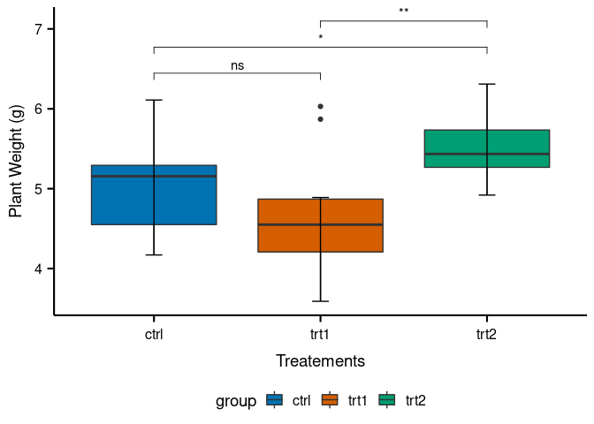
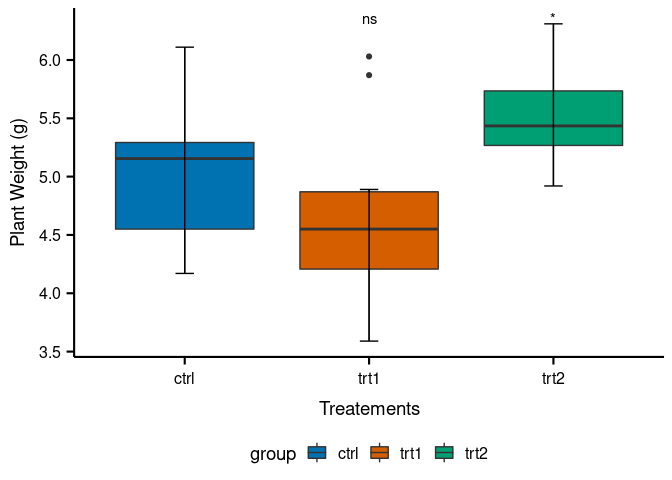
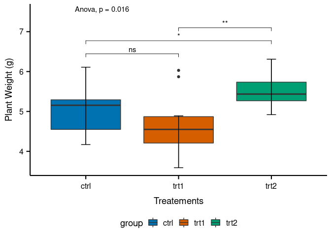
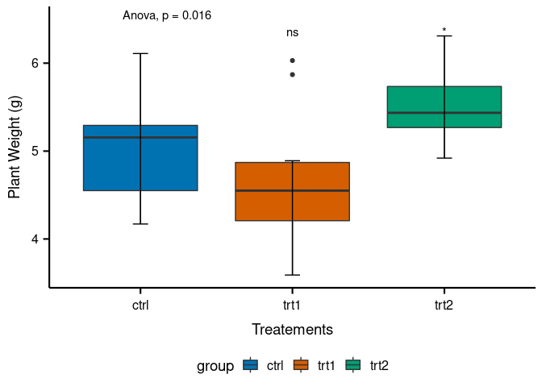

Most common statistical tests in R (Part-1)
================
RwithAammar
([Codanics](https://www.youtube.com/channel/UCmNXJXWONLNF6bdftGY0Otw/playlists))
12/6/2021

# All about multiple comparison of means from RAW data to publication ready graphs in R.

## Install and library (load) the required packages

-   Install the packages

<!-- -->

    install.packages("ggpubr")
    install.packages("ggplot2")
    install.packages("dplyr")
    install.packages("ggpubfigs")

or intsall ggpubfigs like this:

    install.packages("devtools")
    library(devtools)
    devtools::install_github("JLSteenwyk/ggpubfigs")

-   Load required packages

``` r
library(ggpubr)
```

    ## Loading required package: ggplot2

``` r
library(ggplot2)
library(dplyr)
```

    ## 
    ## Attaching package: 'dplyr'

    ## The following objects are masked from 'package:stats':
    ## 
    ##     filter, lag

    ## The following objects are masked from 'package:base':
    ## 
    ##     intersect, setdiff, setequal, union

``` r
library(ggpubfigs)
```

    ## 
    ## Attaching package: 'ggpubfigs'

    ## The following object is masked from 'package:ggplot2':
    ## 
    ##     theme_grey

## One way ANOVA-test:

### Demo data set:

We will use PlantGrowth (a builtin R data set) for this example.

``` r
data("PlantGrowth")
head(PlantGrowth)
```

    ##   weight group
    ## 1   4.17  ctrl
    ## 2   5.58  ctrl
    ## 3   5.18  ctrl
    ## 4   6.11  ctrl
    ## 5   4.50  ctrl
    ## 6   4.61  ctrl

``` r
View(PlantGrowth)
```

### make a simple boxplot

``` r
ggplot(data = PlantGrowth, aes(x= group, y=weight))+
  geom_boxplot()
```

<!-- -->

### add color (fill) argument to boxplot

``` r
ggplot(data = PlantGrowth, aes(x= group, y=weight, fill=group))+
  geom_boxplot()
```

<!-- -->

### Change the axis labels

``` r
ggplot(data = PlantGrowth, aes(x= group, y=weight, fill=group))+
  geom_boxplot()+
  labs(x="Treatements", y="Plant Weight (g)")
```

<!-- -->

### one-way ANOVA test calculations

Two important R functions **aov()** and **summary.aov()** can be used to
see the outcomes of one-way ANOVA model

``` r
# Analysis of variance calculation
model_aov <- aov(weight ~ group, data = PlantGrowth)
# Sumamry to view the output
summary(model_aov)
```

    ##             Df Sum Sq Mean Sq F value Pr(>F)  
    ## group        2  3.766  1.8832   4.846 0.0159 *
    ## Residuals   27 10.492  0.3886                 
    ## ---
    ## Signif. codes:  0 '***' 0.001 '**' 0.01 '*' 0.05 '.' 0.1 ' ' 1

*Pr(>F)* corresponding to the p-value of the test ### Interpretation of
the one-way ANOVA results p-value less than 0.05 shows that model is
significant, we can conclude that there are significant differences
between the groups (treatments) highlighted with “\*” in the summary of
the one-way ANOVA model.

## Multiple pairwise comparison (TUKEY HSD test):

As the ANOVA test is significant, we can compute Tukey HSD (Tukey Honest
Significant Differences, R function: TukeyHSD()) for performing multiple
pairwise-comparison between the means of groups.

We can now compute the Tukey HSD test by using the following function of
R:

``` r
TukeyHSD(model_aov)
```

    ##   Tukey multiple comparisons of means
    ##     95% family-wise confidence level
    ## 
    ## Fit: aov(formula = weight ~ group, data = PlantGrowth)
    ## 
    ## $group
    ##             diff        lwr       upr     p adj
    ## trt1-ctrl -0.371 -1.0622161 0.3202161 0.3908711
    ## trt2-ctrl  0.494 -0.1972161 1.1852161 0.1979960
    ## trt2-trt1  0.865  0.1737839 1.5562161 0.0120064

-   **diff:** difference between means of the two groups
-   **lwr,upr:** the lower and the upper end point of the confidence
    interval at 95% (default)
-   **p adj:** p-value after adjustment for the multiple comparisons. It
    can be seen from the output, that only the difference between trt2
    and trt1 is significant with an adjusted p-value of 0.012, which is
    less than 0.05.

## Visualize and specify the comparisons we want without computing tests:

Define the comparisons in an object

``` r
my_comparisons <- list( c("ctrl", "trt1"), c("ctrl", "trt2"), c("trt1", "trt2"))
```

make a boxplot with errorbar caps

``` r
ggplot(data = PlantGrowth, aes(x= group, y=weight, fill=group))+
  geom_boxplot()+
  labs(x="Treatements", y="Plant Weight (g)")+
  stat_boxplot(geom = 'errorbar', width=0.1)
```

<!-- -->

## publication ready graphs can be made using **ggpubfig** package in the following way:

``` r
ggplot(data = PlantGrowth, aes(x= group, y=weight, fill=group))+
  geom_boxplot()+
  labs(x="Treatements", y="Plant Weight (g)")+
  stat_boxplot(geom = 'errorbar', width=0.1)+
scale_fill_manual(values = friendly_pal("ito_seven")) + theme_simple()
```

<!-- -->

show significant differences of our comparisons on boxplot

``` r
ggplot(data = PlantGrowth, aes(x= group, y=weight, fill=group))+
  geom_boxplot()+
  labs(x="Treatements", y="Plant Weight (g)")+
  stat_boxplot(geom = 'errorbar', width=0.1)+
scale_fill_manual(values = friendly_pal("ito_seven")) + theme_simple()+
  stat_compare_means(method = "t.test", comparisons = my_comparisons)
```

<!-- -->

**- show significant levels instead of using p-values**

``` r
ggplot(data = PlantGrowth, aes(x= group, y=weight, fill=group))+
  geom_boxplot()+
  labs(x="Treatements", y="Plant Weight (g)")+
  stat_boxplot(geom = 'errorbar', width=0.1)+
  scale_fill_manual(values = friendly_pal("ito_seven")) + theme_simple()+
  stat_compare_means(method = "t.test", comparisons = my_comparisons, label = "p.signif") 
```

<!-- -->

``` r
# Pairwise comparison against a reference
```

**- Show significant differences based on a reference treatment, in this
case our reference group treatment will be **ctrl****

``` r
ggplot(data = PlantGrowth, aes(x= group, y=weight, fill=group))+
  geom_boxplot()+
  labs(x="Treatements", y="Plant Weight (g)")+
  stat_boxplot(geom = 'errorbar', width=0.1)+
  scale_fill_manual(values = friendly_pal("ito_seven")) +theme_simple()+
  stat_compare_means(method = "t.test", ref.group = "ctrl", label = "p.signif")
```

<!-- -->

\*\*show ANOVA results

``` r
ggplot(data = PlantGrowth, aes(x= group, y=weight, fill=group))+
  geom_boxplot()+
  labs(x="Treatements", y="Plant Weight (g)")+
  stat_boxplot(geom = 'errorbar', width=0.1)+
  scale_fill_manual(values = friendly_pal("ito_seven")) +theme_simple()+
  stat_compare_means(method = "t.test", comparisons = my_comparisons, label = "p.signif")+ 
  # Pairwise comparison against a reference
  stat_compare_means(method = "anova", label.y = 7.5)
```

<!-- -->

``` r
ggplot(data = PlantGrowth, aes(x= group, y=weight, fill=group))+
  geom_boxplot()+
  labs(x="Treatements", y="Plant Weight (g)")+
  stat_boxplot(geom = 'errorbar', width=0.1)+
  scale_fill_manual(values = friendly_pal("ito_seven")) + theme_simple()+
  stat_compare_means(method = "t.test", ref.group = "ctrl", label = "p.signif")+
  stat_compare_means(method = "anova", label.y = 6.5)
```

<!-- -->

For more content please subscribe our youtube channel
[Codanics](https://www.youtube.com/channel/UCmNXJXWONLNF6bdftGY0Otw/playlists)

Best regards,

Dr Muhammad Aammar Tufail
